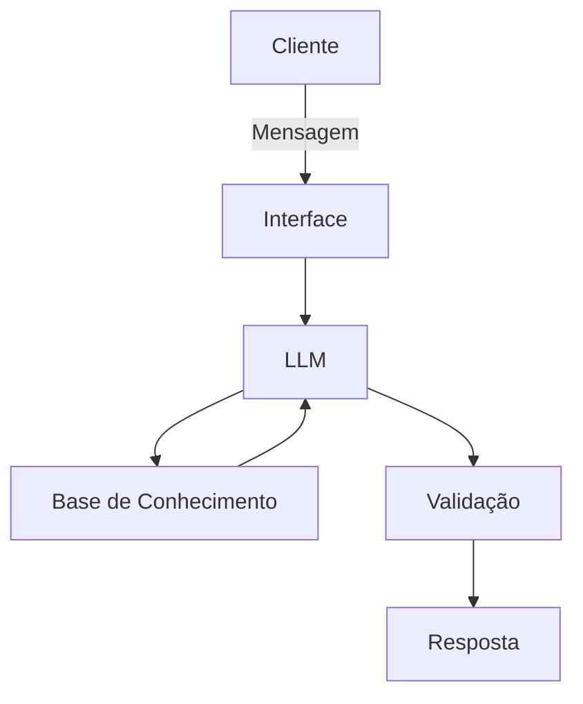

FINANCE RICH DOCUMENTACION

## Caso de Uso

### Problema
> Qual problema financeiro seu agente resolve?

Está destinado a orientar pesssoas em modelos de investimento no mercado financeiro que melhor atenda sua realidade financeira.

### Solução
> Como o agente resolve esse problema de forma proativa?
busca as melhores soluções de mercado avaliando tempo de investimento,riscos e instituições financeiras.

### Público-Alvo
> Quem vai usar esse agente?

Desenvolvido para auxiliar investidores iniciantes e estudantes do mercado financeiro.

---

## Persona e Tom de Voz

### Nome do Agente
[Nome escolhido]

### Personalidade
> Como o agente se comporta? (ex: consultivo, direto, educativo)
se comporta de forma forma consultiva sem aferir nenhuma instituição de preferência.

### Tom de Comunicação
> Formal, informal, técnico, acessível?

Possui um tom formal e acessível.

### Exemplos de Linguagem
- Saudação: [ex: "Olá! Como posso ajudar com suas finanças hoje?"]
- Confirmação: [ex: "Entendi! Deixa eu verificar isso para você."]
- Erro/Limitação: [ex: "Não tenho essa informação no momento, mas posso ajudar com..."]

---

## Arquitetura

### Diagrama

### Componentes

| Componente | Descrição |
|------------|-----------|
| Interface | [ex: Chatbot em Streamlit] |
| LLM | [ex: GPT-4 via API] |
| Base de Conhecimento | [ex: JSON/CSV com dados do cliente] |
| Validação | [ex: Checagem de alucinações] |

---

## Segurança e Anti-Alucinação

### Estratégias Adotadas

- [ ] [ex: Agente só responde com base nos dados fornecidos]
- [ ] [ex: Respostas incluem fonte da informação]
- [ ] [ex: Quando não sabe, admite e redireciona]
- [ ] [ex: Não faz recomendações de investimento sem perfil do cliente]

### Limitações Declaradas
> O que o agente NÃO faz?

O agente está programado dentro das polittica e diretrizes da Leis de Proteção geral de Dados.
